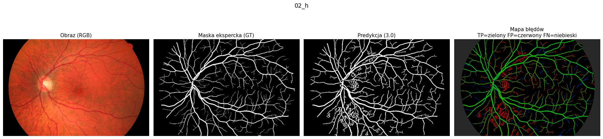
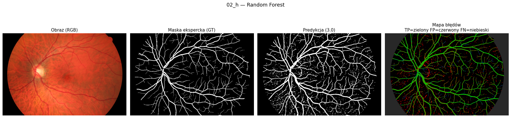
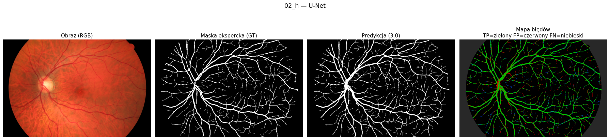
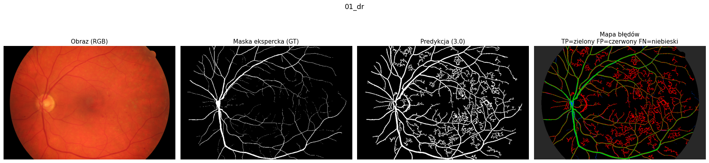
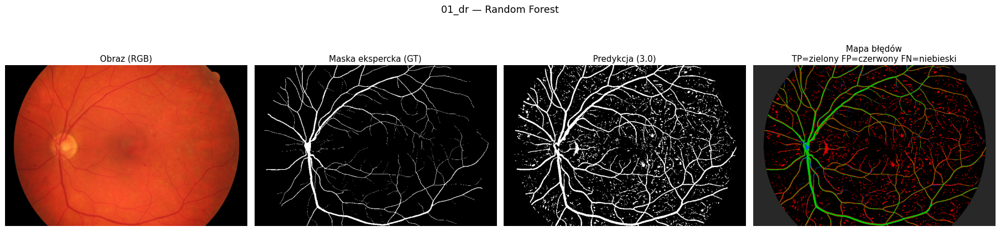
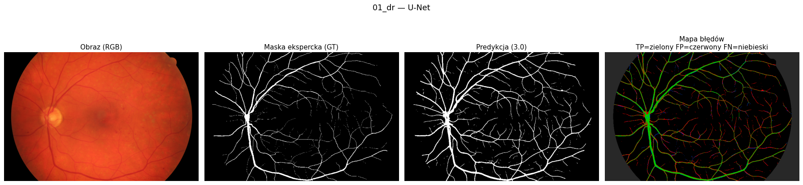

# Raport — Segmentacja naczyń dna oka (IwM, projekt 2)

Wykrywanie naczyń krwionośnych na zdjęciach dna oka — binarna klasyfikacja każdego
piksela (naczynie vs tło) trzema metodami o rosnącej złożoności: przetwarzanie obrazu
(3.0), klasyczne uczenie maszynowe (4.0) i głęboka sieć U-Net (5.0).

## 1. Skład grupy

- _(imię i nazwisko 1)_
- _(imię i nazwisko 2)_

## 2. Język i biblioteki

**Język:** Python 3.11. **Biblioteki:**
- przetwarzanie obrazu: `numpy`, `scipy`, `scikit-image` (filtr Frangiego, CLAHE, morfologia),
- klasyczne ML: `scikit-learn` (KNN, Random Forest), `imbalanced-learn` (miary), `pandas`,
- głębokie uczenie: `PyTorch` (U-Net, akceleracja Apple MPS),
- wizualizacja: `matplotlib`; wczytywanie obrazów: `Pillow`.

Pełna lista z wersjami: [`requirements.txt`](../requirements.txt).

## 3. Dane

Zbiór **HRF** (High-Resolution Fundus): 45 obrazów RGB 3504×2336 w trzech kategoriach
po 15: `_h` (zdrowe), `_dr` (cukrzyca), `_g` (jaskra). HRF dostarcza gotowe maski
eksperckie naczyń oraz maski pola widzenia (FOV). Obrazy skalujemy w dół ×5 (scale=0.2,
→ 467×701) — przyspiesza to obliczenia i ujednolica skalę naczyń.

**Ten sam zbiór i ten sam podział na wszystkich poziomach.** Obrazy testowe (hold-out)
to **te same 6 obrazów** dla 3.0/4.0/5.0 — po dwa z każdej kategorii: `01_h, 02_h,
01_dr, 02_dr, 01_g, 02_g`. Modele uczące (4.0/5.0) nie widziały tych obrazów.
Wszystkie metryki liczymy **tylko wewnątrz FOV** (poza nim nie ma danych eksperta).

> Poziom 3.0 zrealizowaliśmy też pomocniczo na zbiorze STARE
> ([`notebooks/01_przetwarzanie_3.ipynb`](../notebooks/01_przetwarzanie_3.ipynb)), ale
> spójne porównanie wszystkich trzech metod prowadzimy na HRF.

## 4. Opis zastosowanych metod

### 4a. Przetwarzanie obrazu (3.0)

Notebook: [`01_przetwarzanie_3_hrf.ipynb`](../notebooks/01_przetwarzanie_3_hrf.ipynb).
Szczegóły i uzasadnienia: [`proces.md`](proces.md). Kroki:

1. **kanał zielony** — naczynia mają na nim najlepszy kontrast,
2. **CLAHE** — lokalne wyrównanie kontrastu (uwypukla cienkie naczynia przy nierównym oświetleniu),
3. **filtr Frangiego** (`sigmas=1..7`, `black_ridges=True`) — wykrywa wydłużone, ciemne struktury (naczynia),
4. **maska FOV** + erozja krawędzi — krawędź koła oka udawałaby naczynie,
5. **progowanie histerezowe** (`low=0.005`, `high=0.02`) — słaby piksel liczy się tylko gdy łączy się z mocnym → odcina izolowany szum,
6. **usuwanie izolowanych składowych** ≤100 px — naczynia to jedno spójne drzewo.

*Uzasadnienie:* prosty, szybki, nie wymaga uczenia; stanowi punkt odniesienia (baseline).
*Ograniczenie:* zmiany chorobowe (jasne wysięki) mają teksturę podobną do naczyń i dają
fałszywe trafienia, których metoda nie usuwa.

### 4b. Klasyczne uczenie maszynowe (4.0)

Notebook: [`02_klasyczne_ml_4_hrf.ipynb`](../notebooks/02_klasyczne_ml_4_hrf.ipynb).
Moduł cech: [`src/features.py`](../src/features.py).

- **Przygotowanie danych — ekstrakcja cech z otoczenia piksela (patch).** Dla każdego
  piksela liczymy 17 cech (jako mapy na całym obrazie): jasność (kanał zielony+CLAHE),
  rozmycia Gaussa (σ=1,2,4,8), lokalna średnia i odchylenie std. (= wariancja, 2. moment
  centralny) w oknach 5/9/15, lokalne min/max, moduł gradientu (Sobel), różnice Gaussów
  (DoG) oraz odpowiedź filtra Frangiego. Etykieta = wartość maski eksperta w danym pikselu.
- **Wstępne przetwarzanie zbioru uczącego — undersampling.** Klasy są silnie
  niezrównoważone (naczyń ~8–12%). Z 7 obrazów uczących losujemy po 8000 pikseli-naczyń
  i 8000 pikseli-tła na obraz → zbiór zrównoważony 50:50 (112 000 przykładów). Ocena na
  obrazach testowych zostaje na pełnym, realnym rozkładzie.
- **Metody i parametry.** Porównaliśmy:
  - **KNN** (k=11, ze standaryzacją cech `StandardScaler`),
  - **Random Forest** (120 drzew, bez ograniczenia głębokości).
- **Wyniki wstępne (hold-out).** RF wyraźnie lepszy od KNN, KNN dodatkowo wolny w
  predykcji (liczy odległości do wszystkich przykładów). **Wybór: Random Forest.**

*Uzasadnienie:* RF łączy wiele cech i sam uczy się ich progów, więc bije pojedynczy
ręczny próg z poziomu 3.0; jest szybki i odporny na przeuczenie.

### 4c. Głęboka sieć U-Net (5.0)

Notebook: [`03_siec_5_hrf.ipynb`](../notebooks/03_siec_5_hrf.ipynb).
Model: [`src/unet.py`](../src/unet.py).

- **Architektura:** U-Net (enkoder–dekoder ze skip-połączeniami, baza 16 kanałów),
  wejście RGB, wyjście = mapa prawdopodobieństwa „naczynie". Uczona na **całych obrazach**
  (nie wycinkach), dopełnionych do 480×704.
- **Przygotowanie danych:** 39 obrazów uczących (wszystkie poza testowymi), augmentacja
  (losowe odbicia poziome/pionowe).
- **Uczenie:** strata **BCE + Dice** liczona tylko w FOV, optymalizator Adam (lr=1e-3),
  70 epok, ~5 min na Apple MPS.
- **Próg decyzyjny:** sieć przy progu 0,5 ma za niską czułość; obniżenie do **0,10**
  maksymalizuje średnią geometryczną (więcej wykrytych naczyń przy wciąż wysokiej swoistości).
- **Wyniki (hold-out):** najlepsze ze wszystkich metod (tabela niżej).

*Uzasadnienie:* sieć sama uczy się cech z kontekstu całego obrazu, więc lepiej odróżnia
naczynia od tła i zmian chorobowych niż ręcznie zaprojektowane cechy.

## 5. Wizualizacja wyników

Panele: **obraz | maska eksperta (GT) | predykcja | mapa błędów**
(zielony = trafione TP, czerwony = fałszywy alarm FP, niebieski = przeoczone FN).
Komplet w `outputs/`. Poniżej przykłady sukcesu i porażki.

**Sukces — `02_h` (zdrowe), wszystkie metody radzą sobie dobrze, U-Net najczyściej:**

**Trudny przypadek — `01_dr` (cukrzyca):** 3.0 daje dużo fałszywych trafień w rejonie
zmian chorobowych (dużo czerwieni), RF mniej, a U-Net najlepiej oddziela naczynia:

## 6. Analiza wyników i porównanie metod

### Średnie na 6 obrazach testowych (hold-out)

| metoda | trafność | czułość | swoistość | śr. arytm. | śr. geom. |
|--------|:---:|:---:|:---:|:---:|:---:|
| 3.0 — Frangi          | 0,925 | 0,870 | 0,931 | 0,901 | 0,900 |
| 4.0 — Random Forest   | 0,921 | 0,901 | 0,923 | 0,912 | 0,912 |
| **5.0 — U-Net**       | **0,950** | 0,896 | **0,956** | **0,926** | **0,925** |

### Średnia geometryczna per obraz

| obraz | kategoria | 3.0 | 4.0 (RF) | 5.0 (U-Net) |
|-------|-----------|:---:|:---:|:---:|
| 01_h  | zdrowe   | 0,876 | 0,908 | **0,910** |
| 02_h  | zdrowe   | 0,920 | 0,935 | **0,943** |
| 01_dr | cukrzyca | 0,893 | 0,903 | **0,920** |
| 02_dr | cukrzyca | 0,902 | 0,901 | **0,927** |
| 01_g  | jaskra   | 0,906 | 0,915 | **0,923** |
| 02_g  | jaskra   | 0,900 | 0,911 | **0,930** |
| **średnia** |    | 0,900 | 0,912 | **0,925** |

### Wnioski

- **Jakość rośnie z każdym poziomem:** śr. geometryczna 0,900 → 0,912 → 0,925.
  **U-Net wygrywa na każdym z 6 obrazów testowych.**
- **3.0 → 4.0:** RF podnosi głównie **czułość** (0,87 → 0,90) — łapie więcej naczyń, bo
  łączy wiele cech zamiast jednego progu. Swoistość minimalnie spada.
- **4.0 → 5.0:** U-Net poprawia jednocześnie **trafność i swoistość** (0,92 → 0,95/0,96)
  przy zbliżonej czułości — daje najczystsze maski, zwłaszcza w trudnych obrazach
  cukrzycowych (`01_dr`: 0,893 → 0,920), gdzie 3.0 mylił zmiany chorobowe z naczyniami.
- **Koszt:** 3.0 jest natychmiastowe i bez uczenia; RF wymaga ekstrakcji cech i uczenia
  (sekundy); U-Net wymaga wielu obrazów uczących i akceleracji (GPU/MPS, minuty), ale daje
  najlepszy i najbardziej „czysty" wynik.
- **Niezrównoważenie klas:** dlatego oceniamy średnią geometryczną czułości i swoistości,
  a nie samą trafność (opis: [`metryki.md`](metryki.md)).
